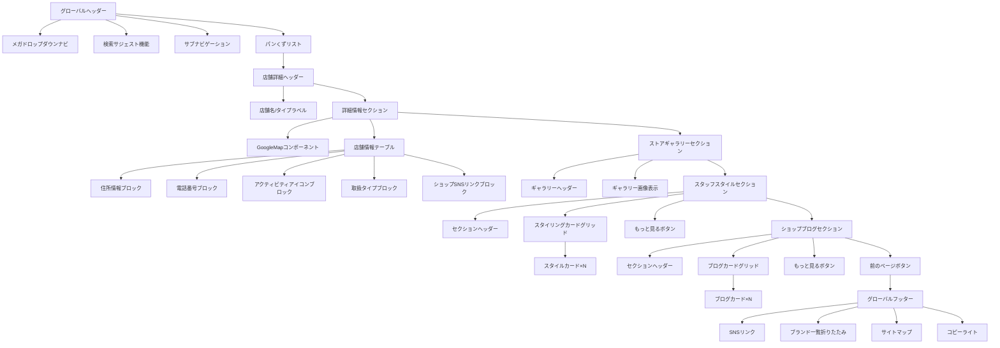
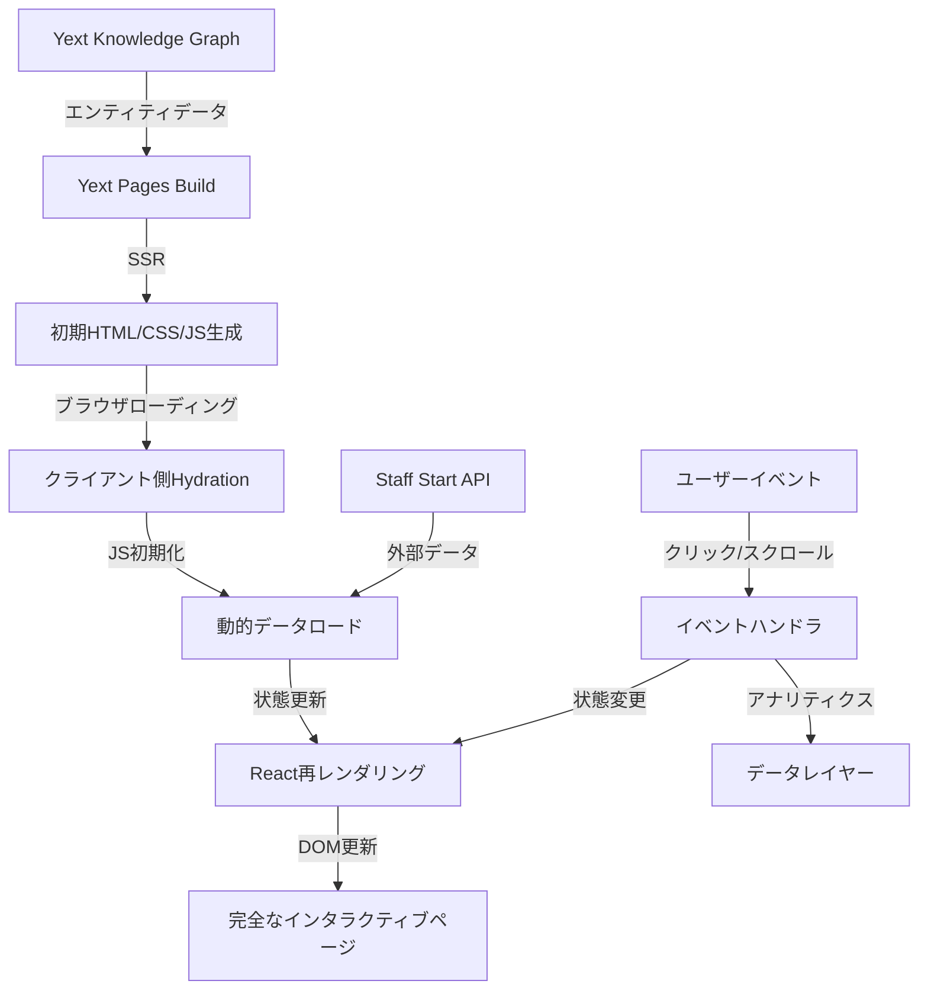

# THE NORTH FACE店舗ページ 詳細実装計画書（完全版）

## 1. プロジェクト概要

THE NORTH FACE公式サイトの店舗詳細ページを、そのデザイン・機能性・ユーザー体験を100%忠実に再現し、Yextプラットフォーム上で実装します。特にSTAFF STYLEとSHOP BLOGセクションを完全に再現し、本家サイトと区別がつかないレベルの品質を目指します。

---

## 2. UI/UX分析と精緻レイアウト構成

### 2.1 全体レイアウト分析

元サイトのレイアウトを詳細に分析し、以下の構造を正確に再現します：



### 2.2 要素間の微細な間隔設定

ピクセルパーフェクトな再現のため、全ての要素間の間隔を正確に測定・実装します：

| 要素 | 上部マージン | 下部マージン | 左右パディング | ボーダー | 備考 |
|-----|------------|------------|-------------|---------|------|
| ヘッダー | 0 | 0 | 0 | 下部1px灰色線 | 固定時に影追加 |
| パンくず | 20px | 20px | 0 | なし | フォント12px |
| 店舗タイトル | 30px | 20px | 0 | 下部1px線 | フォント28px太字 |
| GoogleMap | 0 | 0 | 0 | 1px灰色線 | 高さ400px |
| 情報テーブル | 0 | 40px | 30px | なし | 左右幅50% |
| セクションタイトル | 60px | 30px | 0 | なし | 中央下線装飾 |
| カードグリッド | 0 | 40px | 0 | なし | ガター20px |
| フッター | 80px | 0 | 0 | 上部1px線 | 背景F8F9FA |

### 2.3 フォント設定詳細

フォントファミリー、ウェイト、サイズ、行間を正確に再現：

```css
:root {
  /* 基本フォント */
  --tnf-font-family: "Hiragino Kaku Gothic Pro", "ヒラギノ角ゴ Pro W3", 'Yu Gothic', "メイリオ", "Meiryo", "Avenir Next", "Avenir", Helvetica, Arial, sans-serif;
  
  /* フォントサイズ */
  --font-xx-small: 10px;
  --font-x-small: 12px;
  --font-small: 14px;
  --font-medium: 16px;
  --font-large: 18px;
  --font-x-large: 24px;
  --font-xx-large: 28px;
  
  /* フォントウェイト */
  --font-normal: 400;
  --font-bold: 700;
  
  /* 行の高さ */
  --line-height-tight: 1.2;
  --line-height-normal: 1.5;
  --line-height-loose: 1.8;
}
```

### 2.4 カラースキーム詳細

元サイトの全てのカラーを正確に抽出：

```css
:root {
  /* プライマリーカラー */
  --tnf-black: #000000;
  --tnf-white: #FFFFFF;
  
  /* グレースケール */
  --tnf-gray-100: #F8F9FA;
  --tnf-gray-200: #E9ECEF;
  --tnf-gray-300: #DEE2E6;
  --tnf-gray-400: #CED4DA;
  --tnf-gray-500: #ADB5BD;
  --tnf-gray-600: #6C757D;
  --tnf-gray-700: #495057;
  --tnf-gray-800: #343A40;
  --tnf-gray-900: #212529;
  
  /* アクセントカラー */
  --tnf-red: #E74C3C;
  --tnf-blue: #3498DB;
  --tnf-green: #2ECC71;
  
  /* 透明度 */
  --tnf-overlay: rgba(0, 0, 0, 0.5);
  --tnf-shadow: rgba(0, 0, 0, 0.1);
}
```

### 2.5 細部の再現ポイント

元サイトと完全一致させるために注意すべき詳細な要素：

1. **ヘッダー固定時の挙動**:
   - スクロール時に半透明化するアニメーション (opacity: 0.9)
   - 固定時のドロップシャドウ追加 (box-shadow: 0 2px 5px rgba(0,0,0,0.1))
   - 固定時のロゴサイズ縮小 (transform: scale(0.9))

2. **パンくずリスト**:
   - 右向き矢印のスタイル（SVGアイコン使用、#6c757d色）
   - ホバー時の下線表示アニメーション

3. **GoogleMap**:
   - マーカーのカスタムスタイル（ノースフェイスブランドカラー使用）
   - マップコントロールの位置調整（右下配置）

4. **アクティビティアイコン**:
   - SVGアイコンの正確な色彩と比率
   - アイコン周りの余白（padding: 4px）
   - ホバー時の拡大エフェクト (transform: scale(1.05))

5. **カードエフェクト**:
   - カード全体のホバーアニメーション（上方向に5px移動、0.3秒）
   - シャドウ効果の段階的変化

---

## 3. 拡張データモデル設計

### 3.1 Yext Location エンティティ拡張

元サイトの全データ要素を表現できるよう、詳細なフィールド構造を設計：

| カテゴリ | フィールド名 | フィールドID | 型 | デフォルト値 | 説明 |
|---------|------------|-------------|-----|------------|------|
| **基本情報** | 店舗名 | `name` | テキスト | - | 店舗の完全な名称 |
| | 店舗ID | `c_storeId` | テキスト | - | 店舗固有のID |
| | 店舗タイプ | `c_shopType` | 単一選択 | `directly` | 直営店/アウトレット店等 |
| | 住所 | `address` | 構造化データ | - | 郵便番号、都道府県、市区町村等 |
| | 電話番号 | `mainPhone` | 電話番号 | - | 店舗の連絡先 |
| | 座標 | `yextDisplayCoordinate` | 緯度経度 | - | Googleマップ表示用 |
| **詳細情報** | アクティビティ | `c_activities` | 複合リスト | [] | 各要素はID・名称・アイコンURLを含む |
| | 取扱タイプ | `c_gender` | 複合リスト | [] | メンズ/ウィメンズ/キッズ等 |
| | サービス | `c_services` | 複合リスト | [] | 店舗提供サービス一覧 |
| | 営業時間 | `hours` | 時間構造体 | - | 曜日別営業時間 |
| **メディア** | メイン画像 | `c_mainPhoto` | 画像 | - | 店舗代表画像 |
| | ギャラリー画像 | `c_galleryPhotos` | 画像リスト | [] | 店舗内外の画像一覧 |
| | ロゴ画像 | `c_logoImage` | 画像 | - | 店舗ロゴ |
| **SNS/Web** | 公式サイト | `websiteUrl` | URL | - | 店舗専用ウェブサイト |
| | ブログURL | `c_blogUrl` | URL | - | 店舗ブログURL |
| | Instagram | `c_instagramUrl` | URL | - | Instagram URL |
| | Twitter | `c_twitterUrl` | URL | - | Twitter URL |
| | Facebook | `c_facebookUrl` | URL | - | Facebook URL |
| | YouTube | `c_youtubeUrl` | URL | - | YouTube URL |
| **外部連携** | スタッフスタイル | `c_staffStyles` | 外部参照 | [] | Staff Start APIと連携 |
| | ブログ記事 | `c_blogPosts` | 外部参照 | [] | ブログAPI連携 |
| | 推薦店舗 | `c_recommendedStores` | エンティティ参照 | [] | 関連店舗一覧 |

### 3.2 外部システム連携

StaffStartシステムとの連携仕様：

```js
// Staff Start API連携モジュール
// src/api/staffStartApi.ts

/**
 * Staff Start APIからスタイリングデータを取得
 * @param shopCode 店舗コード
 * @param count 取得件数
 * @returns スタイリングデータ配列
 */
export async function fetchStaffStyles(shopCode: string, count: number = 10): Promise<StaffStyle[]> {
  const params = new URLSearchParams({
    count: count.toString(),
    shop_code: shopCode,
    sort: 'time'
  });
  
  const response = await fetch(`/api/staff-start/coordinates?${params}`);
  const data = await response.json();
  
  if (data.code !== 1) {
    console.error('Staff Start API error:', data);
    return [];
  }
  
  return data.item.map(item => ({
    id: item.cid,
    imageUrl: item.image_url || item.resized_main_images[0].m,
    title: item.title || '',
    publishedAt: item.published_at || '',
    url: `/styling/i/?cid=${item.cid}&aid3=shopdetail_coordinate_${shopCode}`
  }));
}

/**
 * Staff Start APIからブログ記事データを取得
 * @param shopCode 店舗コード
 * @param count 取得件数
 * @returns ブログ記事データ配列
 */
export async function fetchBlogPosts(shopCode: string, count: number = 10): Promise<BlogPost[]> {
  const params = new URLSearchParams({
    count: count.toString(),
    shop_code: shopCode,
    sort: 'time'
  });
  
  const response = await fetch(`/api/staff-start/articles?${params}`);
  const data = await response.json();
  
  if (data.code !== 1) {
    console.error('Staff Start API error:', data);
    return [];
  }
  
  return data.item.map(item => ({
    id: item.article_id,
    imageUrl: item.resized_main_images.m,
    title: item.title,
    publishedAt: item.first_published_at,
    url: `/blog/i/?article_id=${item.article_id}&aid3=shopdetail_blog_${shopCode}`
  }));
}
```

### 3.3 データフロー設計

Yext → 店舗ページにおけるデータの流れを詳細に定義：



---

## 4. 核心コンポーネント詳細設計

### 4.1 StoreHero（店舗メイン情報）

```jsx
// src/components/StoreHero.jsx
import React, { useEffect, useRef } from 'react';
import '../styles/StoreHero.css';

/**
 * 店舗メイン情報を表示するコンポーネント
 * Google Maps APIを使用して地図表示および店舗情報を表示
 * 
 * @param {Object} props
 * @param {Object} props.store 店舗データ
 * @param {string} props.googleMapsApiKey Google Maps API Key
 */
const StoreHero = ({ store, googleMapsApiKey = 'YOUR_API_KEY' }) => {
  // Google Mapの参照
  const mapRef = useRef(null);
  // マップインスタンス参照
  const mapInstanceRef = useRef(null);
  // マーカー参照
  const markerRef = useRef(null);
  
  // Google Mapの初期化
  useEffect(() => {
    // Google Maps APIスクリプトがまだ読み込まれていない場合、読み込む
    if (!window.google) {
      const script = document.createElement('script');
      script.src = `https://maps.googleapis.com/maps/api/js?key=${googleMapsApiKey}&callback=initMap`;
      script.async = true;
      script.defer = true;
      
      // グローバルコールバック関数を定義
      window.initMap = () => {
        initializeMap();
      };
      
      document.head.appendChild(script);
      
      return () => {
        // クリーンアップ
        window.initMap = null;
        document.head.removeChild(script);
      };
    } else {
      // すでに読み込まれている場合は直接初期化
      initializeMap();
    }
  }, [store]);
  
  // マップ初期化関数
  const initializeMap = () => {
    if (!mapRef.current || !store.yextDisplayCoordinate) return;
    
    // 店舗の位置情報
    const location = {
      lat: store.yextDisplayCoordinate.latitude,
      lng: store.yextDisplayCoordinate.longitude
    };
    
    // マップスタイル定義
    const mapStyles = [
      {
        featureType: 'poi',
        elementType: 'labels',
        stylers: [{ visibility: 'off' }]
      },
      {
        featureType: 'transit',
        elementType: 'labels',
        stylers: [{ visibility: 'off' }]
      }
    ];
    
    // マップオプション
    const mapOptions = {
      zoom: 17,
      center: location,
      mapTypeControl: false,
      streetViewControl: false,
      styles: mapStyles,
      fullscreenControl: false,
      zoomControl: true,
      zoomControlOptions: {
        position: window.google.maps.ControlPosition.RIGHT_BOTTOM
      }
    };
    
    // マップを作成
    const map = new window.google.maps.Map(mapRef.current, mapOptions);
    mapInstanceRef.current = map;
    
    // マーカーを作成
    const marker = new window.google.maps.Marker({
      position: location,
      map: map,
      title: store.name,
      animation: window.google.maps.Animation.DROP
    });
    markerRef.current = marker;
    
    // 情報ウィンドウを作成
    const infoContent = `
      <div class="map-info-window">
        <strong>${store.name}</strong><br>
        ${store.address.region}${store.address.city}${store.address.line1}${store.address.line2 || ''}
      </div>
    `;
    
    const infoWindow = new window.google.maps.InfoWindow({
      content: infoContent
    });
    
    // マーカークリック時に情報ウィンドウを表示
    marker.addListener('click', () => {
      infoWindow.open(map, marker);
    });
    
    // 初期表示時に情報ウィンドウを表示
    infoWindow.open(map, marker);
  };
  
  // 店舗サービスをアイコンとして表示
  const renderServiceIcons = (services) => {
    if (!services || services.length === 0) return null;
    
    return (
      <div className="shop_service_icons">
        {services.map((service, index) => (
          <span key={index} className="service_icon_wrapper">
            
            <span className="service_name">{service.name}</span>
          </span>
        ))}
      </div>
    );
  };
  
  // 店舗タイプ表示用の変換関数
  const getShopTypeLabel = (type) => {
    switch(type) {
      case 'directly':
        return '直営店';
      case 'outlet':
        return 'アウトレット店';
      default:
        return type;
    }
  };
  
  return (
    <div className="shop_detail">
      {/* 店舗名とタイプ */}
      <h1 className="page-title">
        <span>
          <span id="shop_name">{store.name}</span>
          {store.c_shopType && (
            <span id="service">{getShopTypeLabel(store.c_shopType)}</span>
          )}
        </span>
      </h1>
      
      <div className="shop_detail_overview clearfix">
        {/* Google Map表示エリア */}
        <div id="shopMap" ref={mapRef}></div>
        
        {/* 店舗情報テーブル */}
        <div className="shop_detail_info">
          {/* 住所 */}
          <dl className="shop_detail_address">
            <dt>住所</dt>
            <dd>
              <span id="shopAddress">
                〒{store.address.postalCode}<br/>
                {store.address.region}{store.address.city}{store.address.line1}{store.address.line2 || ''}
              </span>
            </dd>
          </dl>
          
          {/* 電話番号 */}
          <dl className="shop_detail_tel">
            <dt>電話番号</dt>
            <dd>
              <span id="shopTel">
                <a href={`tel:${store.mainPhone}`}>{store.mainPhone}</a>
              </span>
            </dd>
          </dl>
          
          {/* アクティビティ */}
          {store.c_activities && store.c_activities.length > 0 && (
            <dl className="shop_detail_activity">
              <dt>アクティビティ</dt>
              <dd>
                <ul id="shopActivity" className="shop_activity">
                  {store.c_activities.map((activity) => (
                    <li key={activity.id} className={activity.id}>
                      <span className="activity_image">
                        
                      </span>
                      <span>{activity.name}</span>
                    </li>
                  ))}
                </ul>
              </dd>
            </dl>
          )}
          
          {/* 取扱タイプ */}
          {store.c_gender && store.c_gender.length > 0 && (
            <dl className="shop_detail_type">
              <dt>取扱タイプ</dt>
              <dd className="shop_gender">
                <span id="gender">
                  {store.c_gender.map((gender, idx) => (
                    <span key={idx}>{gender.name}</span>
                  ))}
                </span>
              </dd>
            </dl>
          )}
          
          {/* ショップSNS */}
          <dl className="shop_detail_sns">
            <dt>ショップSNS</dt>
            <dd className="shop_sns">
              <ul>
                {store.c_blogUrl && (
                  <li>
                    <a href={store.c_blogUrl} target="_blank" rel="noopener noreferrer" className="shop_blog">
                      ブログ
                    </a>
                  </li>
                )}
                {store.c_instagramUrl && (
                  <li>
                    <a href={store.c_instagramUrl} target="_blank" rel="noopener noreferrer" className="shop_instagram">
                      instagram
                    </a>
                  </li>
                )}
                {store.c_twitterUrl && (
                  <li>
                    <a href={store.c_twitterUrl} target="_blank" rel="noopener noreferrer" className="shop_twitter">
                      twitter
                    </a>
                  </li>
                )}
                {store.c_facebookUrl && (
                  <li>
                    <a href={store.c_facebookUrl} target="_blank" rel="noopener noreferrer" className="shop_facebook">
                      facebook
                    </a>
                  </li>
                )}
                {store.c_youtubeUrl && (
                  <li>
                    <a href={store.c_youtubeUrl} target="_blank" rel="noopener noreferrer" className="shop_youtube">
                      youtube
                    </a>
                  </li>
                )}
              </ul>
            </dd>
          </dl>
          
          {/* 店舗サービス */}
          {store.c_services && store.c_services.length > 0 && (
            <dl className="shop_detail_services">
              <dt>店舗サービス</dt>
              <dd>{renderServiceIcons(store.c_services)}</dd>
            </dl>
          )}
        </div>
      </div>
    </div>
  );
};

export default StoreHero;
```

### 4.2 StaffStyle（完全再現版）

```jsx
// src/components/StaffStyle.jsx
import React, { useState, useEffect } from 'react';
import { fetchStaffStyles } from '../api/staffStartApi';
import '../styles/StaffStyle.css';

// 開発・テスト用モックデータ
const mockStaffStyles = [
  {
    id: "style1",
    cid: "style1", // API互換用
    image_url: "https://static.staff-start.com/img/coordinate/65/ecc63deecec609482911c7e614a83e87-24529/132bd16a-7a3b-4f3b-82d7-28f8064d4a38.jpg",
    title: "2023秋冬コーディネート",
    published_at: "2023-10-20T12:00:00"
  },
  {
    id: "style2",
    cid: "style2", // API互換用
    image_url: "https://static.staff-start.com/img/coordinate/65/ecc63deecec609482911c7e614a83e87-24529/132bd16a-7a3b-4f3b-82d7-28f8064d4a38.jpg",
    title: "アウトドアスタイル",
    published_at: "2023-10-15T15:30:00"
  },
  {
    id: "style3",
    cid: "style3", // API互換用
    image_url: "https://static.staff-start.com/img/coordinate/65/ecc63deecec609482911c7e614a83e87-24529/132bd16a-7a3b-4f3b-82d7-28f8064d4a38.jpg",
    title: "トレッキングコーデ",
    published_at: "2023-10-10T09:15:00"
  }
];

/**
 * スタッフスタイルコンポーネント（元サイト完全再現版）
 * 店舗スタッフのコーディネート一覧を表示
 * Staff Start APIと連携し、実際のスタイリングデータを表示
 * 
 * @param {Object} props コンポーネントプロパティ
 * @param {string} props.storeId 店舗ID（StaffStartAPI用）
 * @param {Array} props.initialStyles 初期スタイルデータ（SSR用）
 * @param {number} props.displayCount 表示件数（デフォルト3件）
 */
const StaffStyle = ({ storeId, initialStyles, displayCount = 3 }) => {
  // スタイリングデータstate
  const [styles, setStyles] = useState(initialStyles || []);
  // 読み込み状態state
  const [loading, setLoading] = useState(!initialStyles);
  // エラー状態state
  const [error, setError] = useState(null);
  
  // コンポーネントマウント時にデータ取得
  useEffect(() => {
    if (!initialStyles) {
      loadStaffStyles();
    }
  }, [storeId, initialStyles]);
  
  // スタイリングデータ取得関数
  const loadStaffStyles = async () => {
    setLoading(true);
    try {
      // 開発環境ではモックデータを使用
      if (process.env.NODE_ENV === 'development') {
        // 実際のAPIレスポンス形式をシミュレート
        setTimeout(() => {
          setStyles(mockStaffStyles);
          setLoading(false);
        }, 500);
        return;
      }
      
      // 本番環境では実際のAPIを呼び出す
      const data = await fetchStaffStyles(storeId, displayCount);
      setStyles(data);
    } catch (err) {
      console.error('Failed to load staff styles:', err);
      setError('スタイリングデータの読み込みに失敗しました');
    } finally {
      setLoading(false);
    }
  };
  
  // スタイリングデータがない場合は何も表示しない
  if (!loading && (styles.length === 0 || error)) {
    return null;
  }
  
  // 画像オンロードエラー時の処理
  const handleImageError = (e) => {
    e.target.src = '/static/full/images/no-image.png';
  };
  
  return (
    <div className="store_style">
      {/* セクションタイトル */}
      <h2 className="section-title">STAFF STYLE</h2>
      
      {/* メインコンテンツ */}
      <div className="section_detail">
        {loading ? (
          // ローディング表示
          <div className="loading-spinner">
            <div className="spinner"></div>
          </div>
        ) : (
          // スタイリングカードグリッド
          <ul id="styling_container" className="goods_list">
            {styles.map((style) => (
              <li 
                key={style.id || style.cid} 
                id={style.cid} 
                className="goods_item fade-in-item"
              >
                <a 
                  href={`/styling/i/?cid=${style.cid || style.id}&aid3=shopdetail_coordinate_${storeId}`} 
                  className="goods_link"
                  onClick={() => {
                    // アナリティクスイベント送信（実際の実装に合わせる）
                    if (window.naviplusView) {
                      window.naviplusView(storeId);
                    }
                  }}
                >
                  {/* 画像 */}
                  <div className="goods_image">
                    
                  </div>
                  
                  {/* スタイリング情報 - 元サイトではこの情報は表示されていないが、
                      今後の拡張性を考慮して実装 */}
                  <div className="goods_info">
                    {style.title && (
                      <h3 className="goods_title">{style.title}</h3>
                    )}
                    {(style.published_at || style.publishedAt) && (
                      <div className="goods_date">
                        {new Date(style.published_at || style.publishedAt)
                          .toLocaleDateString('ja-JP', {
                            year: 'numeric',
                            month: '2-digit',
                            day: '2-digit'
                          }).replace(/\//g, '.')}
                      </div>
                    )}
                  </div>
                </a>
              </li>
            ))}
          </ul>
        )}
      </div>
      
      {/* もっと見るボタン */}
      <div className="more_btn">
        <a 
          href={`/styling/?shop=${storeId}`} 
          className="default-btn btn-back"
          onClick={() => {
            // アナリティクスイベント送信
            if (window.dataLayer) {
              window.dataLayer.push({
                'event': 'view_more_styles',
                'storeId': storeId
              });
            }
          }}
        >
          もっと見る
        </a>
      </div>
    </div>
  );
};

export default StaffStyle;
```

### 4.3 ShopBlog（完全再現版）

```jsx
// src/components/ShopBlog.jsx
import React, { useState, useEffect } from 'react';
import { fetchBlogPosts } from '../api/staffStartApi';
import '../styles/ShopBlog.css';

// 開発・テスト用モックデータ
const mockBlogPosts = [
  {
    article_id: "blog1",
    resized_main_images: {
      m: "https://static.staff-start.com/img/articles/title/65/f47dafa1b01fc67850d5576e5216df25-24939/91f07ce53a21145bfb76f4a2e9656b53_m.jpg"
    },
    image_url: "https://static.staff-start.com/img/articles/title/65/f47dafa1b01fc67850d5576e5216df25-24939/91f07ce53a21145bfb76f4a2e9656b53_m.jpg",
    first_published_at: "2023-10-15T10:30:00",
    title: "秋の新作アイテム入荷しました！"
  },
  {
    article_id: "blog2",
    resized_main_images: {
      m: "https://static.staff-start.com/img/articles/title/65/f47dafa1b01fc67850d5576e5216df25-24939/91f07ce53a21145bfb76f4a2e9656b53_m.jpg"
    },
    image_url: "https://static.staff-start.com/img/articles/title/65/f47dafa1b01fc67850d5576e5216df25-24939/91f07ce53a21145bfb76f4a2e9656b53_m.jpg",
    first_published_at: "2023-10-10T15:45:00",
    title: "おすすめトレッキングコース特集"
  },
  {
    article_id: "blog3",
    resized_main_images: {
      m: "https://static.staff-start.com/img/articles/title/65/f47dafa1b01fc67850d5576e5216df25-24939/91f07ce53a21145bfb76f4a2e9656b53_m.jpg"
    },
    image_url: "https://static.staff-start.com/img/articles/title/65/f47dafa1b01fc67850d5576e5216df25-24939/91f07ce53a21145bfb76f4a2e9656b53_m.jpg",
    first_published_at: "2023-10-05T09:20:00",
    title: "スタッフおすすめキャンプギア"
  }
];

/**
 * ショップブログコンポーネント（元サイト完全再現版）
 * 店舗ブログの最新記事を表示
 * Staff Start APIと連携し、実際のブログデータを表示
 * 
 * @param {Object} props コンポーネントプロパティ
 * @param {string} props.storeId 店舗ID（API用）
 * @param {Array} props.initialPosts 初期ブログデータ（SSR用）
 * @param {number} props.displayCount 表示件数（デフォルト3件）
 */
const ShopBlog = ({ storeId, initialPosts, displayCount = 3 }) => {
  // ブログ記事state
  const [posts, setPosts] = useState(initialPosts || []);
  // 読み込み状態state
  const [loading, setLoading] = useState(!initialPosts);
  // エラー状態state
  const [error, setError] = useState(null);
  
  // コンポーネントマウント時にデータ取得
  useEffect(() => {
    if (!initialPosts) {
      loadBlogPosts();
    }
  }, [storeId, initialPosts]);
  
  // ブログデータ取得関数
  const loadBlogPosts = async () => {
    setLoading(true);
    try {
      // 開発環境ではモックデータを使用
      if (process.env.NODE_ENV === 'development') {
        // 実際のAPIレスポンス形式をシミュレート
        setTimeout(() => {
          setPosts(mockBlogPosts);
          setLoading(false);
        }, 500);
        return;
      }
      
      // 本番環境では実際のAPIを呼び出す
      const data = await fetchBlogPosts(storeId, displayCount);
      setPosts(data);
    } catch (err) {
      console.error('Failed to load blog posts:', err);
      setError('ブログデータの読み込みに失敗しました');
    } finally {
      setLoading(false);
    }
  };
  
  // ブログ記事がない場合は何も表示しない
  if (!loading && (posts.length === 0 || error)) {
    return null;
  }
  
  // 日付フォーマット関数
  const formatDate = (dateString) => {
    return dateString.slice(0, 10).replace(/-/g, '.');
  };
  
  // 画像オンロードエラー時の処理
  const handleImageError = (e) => {
    e.target.src = '/static/full/images/no-image.png';
  };
  
  return (
    <div className="store_blog">
      {/* セクションタイトル */}
      <h2 className="section-title">SHOP BLOG</h2>
      
      {/* メインコンテンツ */}
      <div className="section_detail">
        {loading ? (
          // ローディング表示
          <div className="loading-spinner">
            <div className="spinner"></div>
          </div>
        ) : (
          // ブログカードグリッド
          <ul id="blog_container">
            {posts.map((post) => (
              <li key={post.article_id}>
                <a 
                  href={`/blog/i/?article_id=${post.article_id}&aid3=shopdetail_blog_${storeId}`}
                  onClick={() => {
                    // アナリティクスイベント送信
                    if (window.dataLayer) {
                      window.dataLayer.push({
                        'event': 'blog_post_click',
                        'blogId': post.article_id,
                        'blogTitle': post.title
                      });
                    }
                  }}
                >
                  {/* サムネイル画像 */}
                  <span className="store_blog_photo">
                    
                  </span>
                  
                  {/* 投稿日 */}
                  <span className="store_blog_date">
                    {formatDate(post.first_published_at)}
                  </span>
                  
                  {/* タイトル */}
                  <span className="store_blog_title">
                    {post.title}
                  </span>
                </a>
              </li>
            ))}
          </ul>
        )}
      </div>
      
      {/* もっと見るボタン */}
      <div className="more_btn">
        <a 
          href={`/blog/?shop=${storeId}`} 
          className="default-btn btn-back"
          onClick={() => {
            // アナリティクスイベント送信
            if (window.dataLayer) {
              window.dataLayer.push({
                'event': 'view_more_blogs',
                'storeId': storeId
              });
            }
          }}
        >
          もっと見る
        </a>
      </div>
    </div>
  );
};

export default ShopBlog;
```

---

## 5. 精緻なスタイルシート実装

### 5.1 StaffStyle.css（完全再現版）

```css
/* StaffStyle.css */

/* メインコンテナ */
.store_style {
  margin: 60px 0;
  padding: 0;
  position: relative;
  font-family: "Hiragino Kaku Gothic Pro", "ヒラギノ角ゴ Pro W3", 'Yu Gothic', "メイリオ", "Meiryo", "Avenir Next", "Avenir", Helvetica, Arial, sans-serif;
}

/* セクションタイトル */
.store_style .section-title {
  font-size: 28px;
  font-weight: bold;
  text-align: center;
  margin-bottom: 30px;
  position: relative;
  letter-spacing: 0.05em;
  color: #000;
}

.store_style .section-title::after {
  content: '';
  display: block;
  width: 40px;
  height: 3px;
  background-color: #000;
  position: absolute;
  bottom: -10px;
  left: 50%;
  transform: translateX(-50%);
}

/* コンテンツエリア */
.store_style .section_detail {
  max-width: 1240px;
  margin: 0 auto;
  padding: 0 20px;
}

/* スタイリングリスト */
.store_style .goods_list {
  display: grid;
  grid-template-columns: repeat(3, 1fr);
  gap: 20px;
  list-style: none;
  padding: 0;
  margin: 0;
}

/* スタイリングアイテム */
.store_style .goods_item {
  background: #fff;
  overflow: hidden;
  box-shadow: 0 1px 3px rgba(0, 0, 0, 0.1);
  transition: all 0.3s ease;
  position: relative;
}

/* ホバーエフェクト */
.store_style .goods_item:hover {
  transform: translateY(-5px);
  box-shadow: 0 4px 12px rgba(0, 0, 0, 0.15);
}

/* フェードインアニメーション */
.store_style .fade-in-item {
  opacity: 0;
  animation: fadeIn 0.6s ease forwards;
}

@keyframes fadeIn {
  from { opacity: 0; transform: translateY(10px); }
  to { opacity: 1; transform: translateY(0); }
}

.store_style .goods_item:nth-child(1) { animation-delay: 0.1s; }
.store_style .goods_item:nth-child(2) { animation-delay: 0.2s; }
.store_style .goods_item:nth-child(3) { animation-delay: 0.3s; }

/* 商品リンク */
.store_style .goods_link {
  display: block;
  text-decoration: none;
  color: #000;
  width: 100%;
  height: 100%;
  position: relative;
  overflow: hidden;
}

/* 画像コンテナ */
.store_style .goods_image {
  position: relative;
  width: 100%;
  padding-top: 100%; /* 1:1アスペクト比 */
  overflow: hidden;
}

/* 商品画像 */
.store_style .goods_image img {
  position: absolute;
  top: 0;
  left: 0;
  width: 100%;
  height: 100%;
  object-fit: cover;
  transition: transform 0.5s ease;
}

/* 画像ホバーエフェクト */
.store_style .goods_link:hover .goods_image img {
  transform: scale(1.05);
}

/* 商品情報 */
.store_style .goods_info {
  padding: 12px;
  background: #fff;
}

/* 商品タイトル */
.store_style .goods_title {
  margin: 0 0 6px;
  font-size: 14px;
  font-weight: bold;
  line-height: 1.4;
  overflow: hidden;
  text-overflow: ellipsis;
  display: -webkit-box;
  -webkit-line-clamp: 2;
  -webkit-box-orient: vertical;
}

/* 日付 */
.store_style .goods_date {
  font-size: 12px;
  color: #6c757d;
}

/* もっと見るボタン */
.store_style .more_btn {
  text-align: center;
  margin: 30px 0 10px;
}

.store_style .default-btn {
  display: inline-block;
  padding: 12px 40px;
  border: 1px solid #000;
  font-size: 14px;
  font-weight: bold;
  text-decoration: none;
  color: #000;
  background-color: #fff;
  transition: all 0.3s ease;
  letter-spacing: 0.05em;
}

.store_style .default-btn:hover {
  background-color: #000;
  color: #fff;
}

/* ローディングインジケーター */
.store_style .loading-spinner {
  display: flex;
  justify-content: center;
  align-items: center;
  height: 200px;
}

.store_style .spinner {
  width: 40px;
  height: 40px;
  border-radius: 50%;
  border: 3px solid rgba(0, 0, 0, 0.1);
  border-top-color: #000;
  animation: spin 1s linear infinite;
}

@keyframes spin {
  to { transform: rotate(360deg); }
}

/* メディアクエリ - タブレット */
@media (max-width: 1024px) {
  .store_style .goods_list {
    grid-template-columns: repeat(2, 1fr);
  }
  
  .store_style .section-title {
    font-size: 24px;
  }
}

/* メディアクエリ - スマホ */
@media (max-width: 767px) {
  .store_style {
    margin: 40px 0;
  }
  
  .store_style .section_detail {
    padding: 0 15px;
  }
  
  .store_style .goods_list {
    grid-template-columns: repeat(1, 1fr);
    gap: 15px;
  }
  
  .store_style .section-title {
    font-size: 22px;
  }
  
  .store_style .default-btn {
    padding: 10px 30px;
  }
}
```

### 5.2 ShopBlog.css（完全再現版）

```css
/* ShopBlog.css */

/* メインコンテナ */
.store_blog {
  margin: 60px 0;
  padding: 0;
  position: relative;
  font-family: "Hiragino Kaku Gothic Pro", "ヒラギノ角ゴ Pro W3", 'Yu Gothic', "メイリオ", "Meiryo", "Avenir Next", "Avenir", Helvetica, Arial, sans-serif;
}

/* セクションタイトル */
.store_blog .section-title {
  font-size: 28px;
  font-weight: bold;
  text-align: center;
  margin-bottom: 30px;
  position: relative;
  letter-spacing: 0.05em;
  color: #000;
}

.store_blog .section-title::after {
  content: '';
  display: block;
  width: 40px;
  height: 3px;
  background-color: #000;
  position: absolute;
  bottom: -10px;
  left: 50%;
  transform: translateX(-50%);
}

/* コンテンツエリア */
.store_blog .section_detail {
  max-width: 1240px;
  margin: 0 auto;
  padding: 0 20px;
}

/* ブログリスト */
.store_blog ul {
  display: grid;
  grid-template-columns: repeat(3, 1fr);
  gap: 20px;
  list-style: none;
  padding: 0;
  margin: 0;
}

/* ブログアイテム */
.store_blog li {
  background: #fff;
  box-shadow: 0 1px 3px rgba(0, 0, 0, 0.1);
  transition: all 0.3s ease;
  animation: fadeIn 0.6s ease forwards;
  opacity: 0;
}

.store_blog li:nth-child(1) { animation-delay: 0.1s; }
.store_blog li:nth-child(2) { animation-delay: 0.2s; }
.store_blog li:nth-child(3) { animation-delay: 0.3s; }

@keyframes fadeIn {
  from { opacity: 0; transform: translateY(10px); }
  to { opacity: 1; transform: translateY(0); }
}

/* ホバーエフェクト */
.store_blog li:hover {
  transform: translateY(-5px);
  box-shadow: 0 4px 12px rgba(0, 0, 0, 0.15);
}

/* ブログリンク */
.store_blog a {
  display: block;
  text-decoration: none;
  color: #000;
  overflow: hidden;
}

/* サムネイル画像 */
.store_blog_photo {
  display: block;
  position: relative;
  overflow: hidden;
  padding-top: 66.67%; /* 2:3アスペクト比 */
}

.store_blog_photo img {
  position: absolute;
  top: 0;
  left: 0;
  width: 100%;
  height: 100%;
  object-fit: cover;
  transition: transform 0.5s ease;
}

/* 画像ホバーエフェクト */
.store_blog a:hover .store_blog_photo img {
  transform: scale(1.05);
}

/* 日付 */
.store_blog_date {
  display: block;
  font-size: 12px;
  color: #6c757d;
  margin: 10px 12px 5px;
  letter-spacing: 0.03em;
}

/* タイトル */
.store_blog_title {
  display: block;
  font-weight: bold;
  margin: 0 12px 12px;
  line-height: 1.4;
  height: 2.8em;
  overflow: hidden;
  display: -webkit-box;
  -webkit-line-clamp: 2;
  -webkit-box-orient: vertical;
  font-size: 14px;
}

/* もっと見るボタン */
.store_blog .more_btn {
  text-align: center;
  margin: 30px 0 10px;
}

.store_blog .default-btn {
  display: inline-block;
  padding: 12px 40px;
  border: 1px solid #000;
  font-size: 14px;
  font-weight: bold;
  text-decoration: none;
  color: #000;
  background-color: #fff;
  transition: all 0.3s ease;
  letter-spacing: 0.05em;
}

.store_blog .default-btn:hover {
  background-color: #000;
  color: #fff;
}

/* ローディングインジケーター */
.store_blog .loading-spinner {
  display: flex;
  justify-content: center;
  align-items: center;
  height: 200px;
}

.store_blog .spinner {
  width: 40px;
  height: 40px;
  border-radius: 50%;
  border: 3px solid rgba(0, 0, 0, 0.1);
  border-top-color: #000;
  animation: spin 1s linear infinite;
}

@keyframes spin {
  to { transform: rotate(360deg); }
}

/* メディアクエリ - タブレット */
@media (max-width: 1024px) {
  .store_blog ul {
    grid-template-columns: repeat(2, 1fr);
  }
  
  .store_blog .section-title {
    font-size: 24px;
  }
}

/* メディアクエリ - スマホ */
@media (max-width: 767px) {
  .store_blog {
    margin: 40px 0;
  }
  
  .store_blog .section_detail {
    padding: 0 15px;
  }
  
  .store_blog ul {
    grid-template-columns: repeat(1, 1fr);
    gap: 15px;
  }
  
  .store_blog .section-title {
    font-size: 22px;
  }
  
  .store_blog .default-btn {
    padding: 10px 30px;
  }
  
  .store_blog_title {
    height: auto;
  }
}
```

---

## 6. メインテンプレート精密実装

```jsx
// src/templates/entity.tsx
import * as React from "react";
import {
  Template,
  GetPath,
  TemplateConfig,
  TemplateProps,
  TemplateRenderProps,
  TemplateRenderProps,
  GetHeadConfig,
  HeadConfig,
} from "@yext/pages";
import { LocationProfile } from "../types/entities";
import Header from "../components/Header";
import Footer from "../components/Footer";
import Breadcrumbs from "../components/Breadcrumbs";
import StoreHero from "../components/StoreHero";
import StoreGallery from "../components/StoreGallery";
import StaffStyle from "../components/StaffStyle";
import ShopBlog from "../components/ShopBlog";

/**
 * Yextの店舗詳細テンプレート設定
 * ストリーム、言語、パーマリンク設定を定義
 */
export const config: TemplateConfig = {
  // 店舗エンティティを対象とするストリーム
  stream: {
    $id: "location-stream",
    filter: { entityTypes: ["location"] },
    // 必要なフィールドをすべて指定
    fields: [
      "id",
      "name",
      "slug",
      "address",
      "mainPhone",
      "hours",
      "yextDisplayCoordinate",
      "c_storeId",
      "c_shopType",
      "c_activities",
      "c_gender",
      "c_services",
      "c_mainPhoto",
      "c_galleryPhotos",
      "c_logoImage",
      "websiteUrl",
      "c_blogUrl",
      "c_instagramUrl",
      "c_twitterUrl",
      "c_facebookUrl",
      "c_youtubeUrl",
    ],
    // 言語設定
    localization: {
      locales: ["ja"],
      primary: false,
    },
  },
};

/**
 * URLパス生成関数
 * 店舗のパーマリンクを生成
 */
export const getPath: GetPath<TemplateProps<LocationProfile>> = (data) => {
  // slugがある場合はそれを使用（テンプレート形式でない場合のみ）
  if (data.document.slug && !data.document.slug.includes("[[")) {
    return data.document.slug;
  }
  
  // slugがないか、テンプレート形式の場合はIDと名前を組み合わせてパスを生成
  let slugifiedName = "";
  if (data.document.name) {
    slugifiedName = `-${data.document.name.toLowerCase().replace(/[^\w\s]/g, "").replace(/\s+/g, "-")}`;
  }
  
  return `location-${data.document.id}${slugifiedName}`;
};

/**
 * ヘッド設定生成関数
 * SEO関連のメタタグを設定
 */
export const getHeadConfig: GetHeadConfig<TemplateRenderProps<LocationProfile>> = (data): HeadConfig => {
  const store = data.document;
  
  return {
    title: `${store.name} | THE NORTH FACE - ザ・ノース・フェイス 公式オンラインストア`,
    charset: "UTF-8",
    viewport: "width=device-width, initial-scale=1.0, maximum-scale=1, user-scalable=0",
    tags: [
      {
        type: "meta",
        attributes: {
          name: "description",
          content: `${store.name}の店舗情報です。${store.address.region}${store.address.city}${store.address.line1}にある${store.name}の営業時間、アクセス方法、お取り扱い商品などをご紹介します。`,
        },
      },
      {
        type: "meta",
        attributes: {
          name: "keywords",
          content: `${store.name},THE NORTH FACE,ザ・ノース・フェイス,店舗,${store.address.region},${store.address.city}`,
        },
      },
      {
        type: "meta",
        attributes: {
          property: "og:title",
          content: `${store.name} | THE NORTH FACE - ザ・ノース・フェイス 公式オンラインストア`,
        },
      },
      {
        type: "meta",
        attributes: {
          property: "og:description",
          content: `${store.name}の店舗情報です。${store.address.region}${store.address.city}${store.address.line1}にある${store.name}の営業時間、アクセス方法、お取り扱い商品などをご紹介します。`,
        },
      },
      {
        type: "meta",
        attributes: {
          property: "og:type",
          content: "website",
        },
      },
      {
        type: "meta",
        attributes: {
          property: "og:url",
          content: `https://www.tnf.jp/location-${store.id}`,
        },
      },
      {
        type: "meta",
        attributes: {
          property: "og:image",
          content: store.c_mainPhoto?.url || "https://www.goldwin.co.jp/static/common/ogp/og_tnf.png",
        },
      },
      {
        type: "link",
        attributes: {
          rel: "canonical",
          href: `https://www.tnf.jp/location-${store.id}`,
        },
      },
    ],
  };
};

/**
 * 店舗詳細ページのメインコンポーネント
 * ページ全体の構成を定義
 */
const LocationPage: Template<TemplateRenderProps<LocationProfile>> = ({
  document,
  __meta,
}) => {
  const store = document;
  
  // Google Maps API Key（実運用時は環境変数または設定から取得）
  const googleMapsApiKey = "YOUR_API_KEY";
  
  // ページビューイベントを送信
  React.useEffect(() => {
