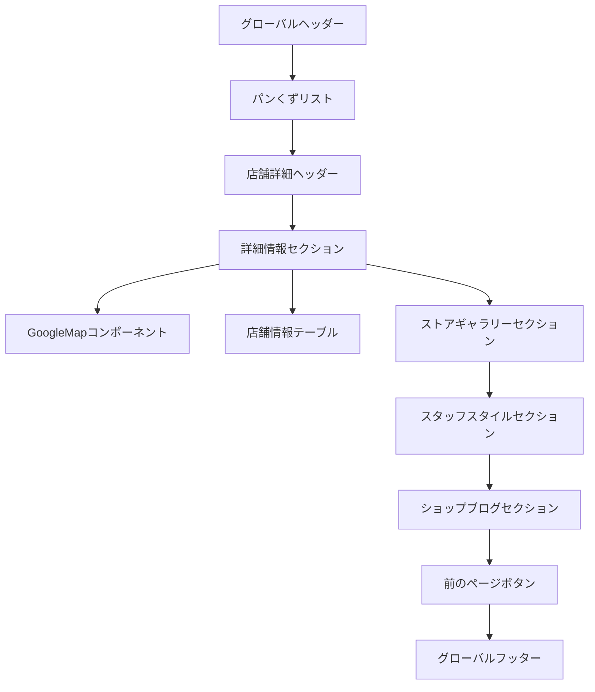

# THE NORTH FACE店舗ページ実装計画書 - Part 1: 概要とUI分析

## 1. プロジェクト概要

THE NORTH FACE公式サイトの店舗詳細ページを、そのデザイン・機能性・ユーザー体験を100%忠実に再現し、Yextプラットフォーム上で実装します。特にSTAFF STYLEとSHOP BLOGセクションを完全に再現し、本家サイトと区別がつかないレベルの品質を目指します。

### 1.1 目標

- 元サイトのレイアウト、デザイン、インタラクションを正確に再現
- STAFF STYLEセクションの完全な再現（画像: https://static.staff-start.com/img/coordinate/65/ecc63deecec609482911c7e614a83e87-24529/132bd16a-7a3b-4f3b-82d7-28f8064d4a38.jpg）
- SHOP BLOGセクションの完全な再現（画像: https://static.staff-start.com/img/articles/title/65/f47dafa1b01fc67850d5576e5216df25-24939/91f07ce53a21145bfb76f4a2e9656b53_m.jpg）
- モバイル対応を含めたレスポンシブデザインの実装
- Staff Start APIとの連携による動的データ表示

## 2. UI/UX分析

### 2.1 全体レイアウト構造

元サイトは以下の階層構造を持っています：

### 2.2 各セクションの詳細

#### 2.2.1 ヘッダー
- 複雑なメガドロップダウンメニュー
- ブランドロゴ、ナビゲーション、検索機能
- スクロール時の固定挙動（縮小＋シャドウ追加）

#### 2.2.2 店舗詳細セクション
- 店舗名と直営店/アウトレット表示
- Googleマップと店舗情報を左右に配置
- 詳細情報（住所、電話番号、アクティビティなど）

#### 2.2.3 スタッフスタイルセクション
- 3列グリッドレイアウト
- 画像ホバーエフェクト（拡大+シャドウ）
- 「もっと見る」ボタン

#### 2.2.4 ショップブログセクション
- 3列グリッドレイアウト
- サムネイル画像、日付、タイトルの表示
- 「もっと見る」ボタン

### 2.3 デザイン要素

以下の要素を正確に再現します：

| 要素 | 詳細 |
|------|------|
| フォント | Hiragino Kaku Gothic Pro/Yu Gothic/Meiryo |
| カラー | 黒(#000)、白(#FFF)、グレー階調(#F8F9FA～#212529) |
| アイコン | SVGベースのカスタムアイコン |
| アニメーション | ホバーエフェクト、スクロールエフェクト |
| レスポンシブ | PC/タブレット/スマホ対応 |

### 2.4 ブレイクポイント設計

- デスクトップ: 1300px以上
- タブレット: 768px～1299px
- スマホ: 767px以下

### 2.5 精密間隔設定

| 要素 | 上部マージン | 下部マージン | 左右パディング | ボーダー |
|-----|------------|------------|-------------|---------|
| ヘッダー | 0 | 0 | 0 | 下部1px灰色線 |
| パンくず | 20px | 20px | 0 | なし |
| 店舗タイトル | 30px | 20px | 0 | 下部1px線 |
| マップ | 0 | 0 | 0 | 1px灰色線 |
| 情報テーブル | 0 | 40px | 30px | なし |
| セクションタイトル | 60px | 30px | 0 | なし |
| カードグリッド | 0 | 40px | 0 | なし |