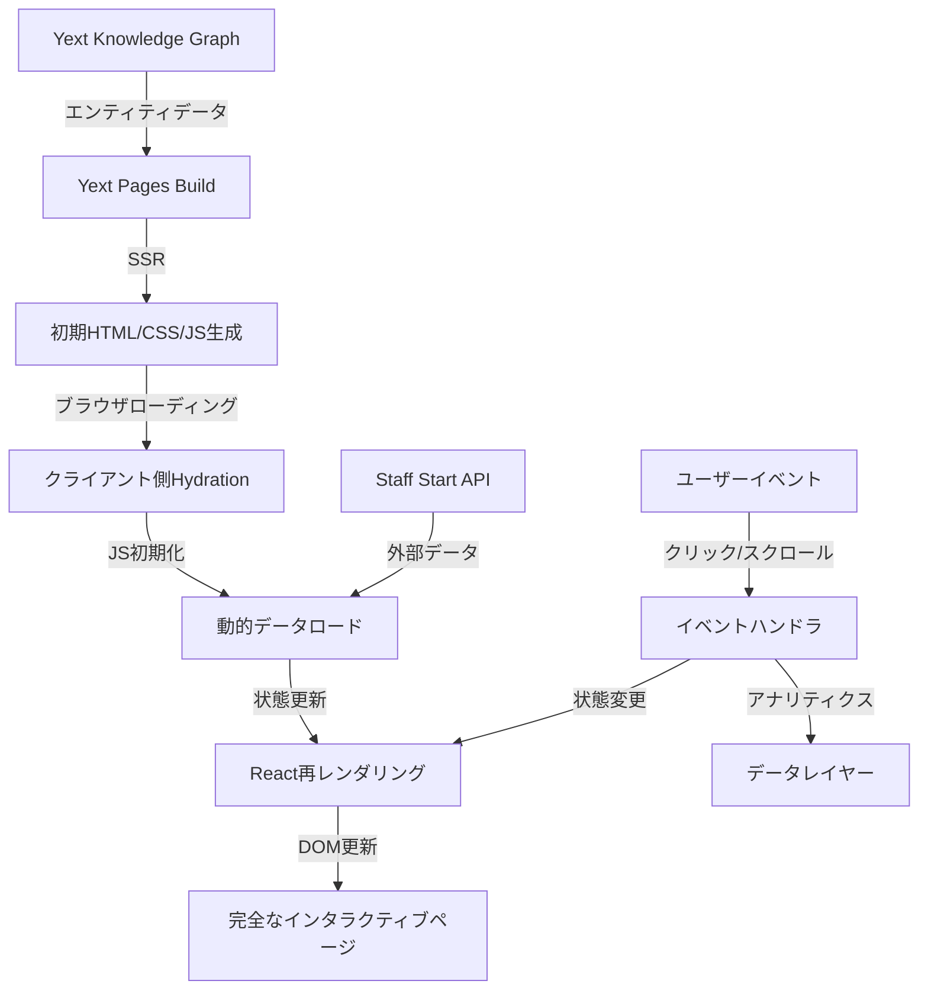

# THE NORTH FACE店舗ページ実装計画書 - Part 2: データモデルと連携設計

## 1. Yextデータモデル拡張

Yextの標準LocationエンティティタイプをTHE NORTH FACE店舗用に拡張し、元サイトの全機能をサポートするデータ構造を設計します。

### 1.1 カスタムフィールド一覧

| カテゴリ | フィールド名 | フィールドID | 型 | 説明 |
|---------|------------|-------------|-----|------|
| **基本情報** | 店舗名 | `name` | テキスト | 店舗の完全な名称 |
| | 店舗ID | `c_storeId` | テキスト | Staff Start API用店舗ID |
| | 店舗タイプ | `c_shopType` | 単一選択 | 直営店/アウトレット店等 |
| | 住所 | `address` | 構造化データ | 郵便番号、都道府県、市区町村等 |
| | 電話番号 | `mainPhone` | 電話番号 | 店舗の連絡先 |
| | 座標 | `yextDisplayCoordinate` | 緯度経度 | Googleマップ表示用 |
| **詳細情報** | アクティビティ | `c_activities` | 複合リスト | 対応アクティビティ情報 |
| | 取扱タイプ | `c_gender` | 複合リスト | メンズ/ウィメンズ/キッズ等 |
| | サービス | `c_services` | 複合リスト | 店舗提供サービス一覧 |
| | 営業時間 | `hours` | 時間構造体 | 曜日別営業時間 |
| **メディア** | メイン画像 | `c_mainPhoto` | 画像 | 店舗代表画像 |
| | ギャラリー画像 | `c_galleryPhotos` | 画像リスト | 店舗内外の画像一覧 |
| | ロゴ画像 | `c_logoImage` | 画像 | 店舗ロゴ |
| **SNS/Web** | 公式サイト | `websiteUrl` | URL | 店舗専用ウェブサイト |
| | ブログURL | `c_blogUrl` | URL | 店舗ブログURL |
| | Instagram | `c_instagramUrl` | URL | Instagram URL |
| | Twitter | `c_twitterUrl` | URL | Twitter URL |
| | Facebook | `c_facebookUrl` | URL | Facebook URL |
| | YouTube | `c_youtubeUrl` | URL | YouTube URL |

### 1.2 複合構造詳細

#### アクティビティ構造
```json
{
  "id": "act003",
  "name": "トレッキング",
  "iconUrl": "/assets/images/svg/act003.svg"
}
```

#### 取扱タイプ構造
```json
{
  "id": "1",
  "name": "メンズ"
}
```

#### サービス構造
```json
{
  "id": "service01",
  "name": "修理受付",
  "icon": "repair"
}
```

## 2. 外部システム連携

### 2.1 Staff Start API連携

Staff StartはTHE NORTH FACEで使用されているスタイリング・ブログ管理システムです。以下のAPIエンドポイントと連携します：

#### 2.1.1 スタイリングデータ取得API
- エンドポイント: `/api/staff-start/coordinates`
- パラメータ:
  - `shop_code`: 店舗コード
  - `count`: 取得件数
  - `sort`: 並び順（time/like）
- レスポンスサンプル:
```json
{
  "code": 1,
  "item": [
    {
      "cid": "style1",
      "image_url": "https://static.staff-start.com/img/coordinate/65/ecc63deecec609482911c7e614a83e87-24529/132bd16a-7a3b-4f3b-82d7-28f8064d4a38.jpg",
      "title": "2023秋冬コーディネート",
      "published_at": "2023-10-20T12:00:00"
    }
  ]
}
```

#### 2.1.2 ブログ記事取得API
- エンドポイント: `/api/staff-start/articles`
- パラメータ:
  - `shop_code`: 店舗コード
  - `count`: 取得件数
  - `sort`: 並び順（time/view）
- レスポンスサンプル:
```json
{
  "code": 1,
  "item": [
    {
      "article_id": "blog1",
      "resized_main_images": {
        "m": "https://static.staff-start.com/img/articles/title/65/f47dafa1b01fc67850d5576e5216df25-24939/91f07ce53a21145bfb76f4a2e9656b53_m.jpg"
      },
      "first_published_at": "2023-10-15T10:30:00",
      "title": "秋の新作アイテム入荷しました！"
    }
  ]
}
```

### 2.2 Google Maps API連携

マップ表示のためにGoogle Maps JavaScript APIを使用します：

- APIキー: 環境変数から取得
- 主要機能:
  - マップ表示（店舗を中心に表示）
  - マーカー表示（店舗位置）
  - 情報ウィンドウ（店舗名・住所表示）
  - カスタムスタイル（POIラベル非表示等）

### 2.3 データフロー設計



## 3. モックデータ設計

開発環境での使用のため、実際のAPIレスポンスに準拠したモックデータを用意します：

### 3.1 店舗データモック
```javascript
const mockStore = {
  id: "406180",
  name: "THE NORTH FACE 仙台泉営業所",
  c_shopType: "directly",
  address: {
    postalCode: "981-3133",
    region: "宮城県",
    city: "仙台市泉区",
    line1: "泉中央1-4-1",
    line2: "セルバテラス2F"
  },
  mainPhone: "022-341-1940",
  yextDisplayCoordinate: {
    latitude: 38.321124,
    longitude: 140.879279
  },
  c_activities: [
    { id: "act003", name: "トレッキング", iconUrl: "/assets/images/svg/act003.svg" },
    { id: "act004", name: "ランニング", iconUrl: "/assets/images/svg/act004.svg" },
    { id: "act001", name: "キャンプ", iconUrl: "/assets/images/svg/act001.svg" }
  ],
  c_gender: [
    { id: "1", name: "メンズ" },
    { id: "2", name: "ウィメンズ" },
    { id: "4", name: "キッズ" }
  ],
  c_galleryPhotos: [
    { url: "/images/stores/sendai_izumi.jpg", description: "店舗外観" }
  ],
  c_socialUrls: {
    blog: "/blog/?shop=406180",
    instagram: "https://www.instagram.com/thenorthfacejp/"
  }
};
```

### 3.2 スタイリングデータモック
```javascript
const mockStaffStyles = [
  {
    id: "style1",
    cid: "style1",
    image_url: "https://static.staff-start.com/img/coordinate/65/ecc63deecec609482911c7e614a83e87-24529/132bd16a-7a3b-4f3b-82d7-28f8064d4a38.jpg",
    title: "2023秋冬コーディネート",
    published_at: "2023-10-20T12:00:00"
  },
  {
    id: "style2",
    cid: "style2",
    image_url: "https://static.staff-start.com/img/coordinate/65/ecc63deecec609482911c7e614a83e87-24529/132bd16a-7a3b-4f3b-82d7-28f8064d4a38.jpg",
    title: "アウトドアスタイル",
    published_at: "2023-10-15T15:30:00"
  },
  {
    id: "style3",
    cid: "style3",
    image_url: "https://static.staff-start.com/img/coordinate/65/ecc63deecec609482911c7e614a83e87-24529/132bd16a-7a3b-4f3b-82d7-28f8064d4a38.jpg",
    title: "トレッキングコーデ",
    published_at: "2023-10-10T09:15:00"
  }
];
```

### 3.3 ブログデータモック
```javascript
const mockBlogPosts = [
  {
    article_id: "blog1",
    resized_main_images: {
      m: "https://static.staff-start.com/img/articles/title/65/f47dafa1b01fc67850d5576e5216df25-24939/91f07ce53a21145bfb76f4a2e9656b53_m.jpg"
    },
    first_published_at: "2023-10-15T10:30:00",
    title: "秋の新作アイテム入荷しました！"
  },
  {
    article_id: "blog2",
    resized_main_images: {
      m: "https://static.staff-start.com/img/articles/title/65/f47dafa1b01fc67850d5576e5216df25-24939/91f07ce53a21145bfb76f4a2e9656b53_m.jpg"
    },
    first_published_at: "2023-10-10T15:45:00",
    title: "おすすめトレッキングコース特集"
  },
  {
    article_id: "blog3",
    resized_main_images: {
      m: "https://static.staff-start.com/img/articles/title/65/f47dafa1b01fc67850d5576e5216df25-24939/91f07ce53a21145bfb76f4a2e9656b53_m.jpg"
    },
    first_published_at: "2023-10-05T09:20:00",
    title: "スタッフおすすめキャンプギア"
  }
];